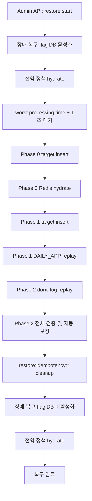
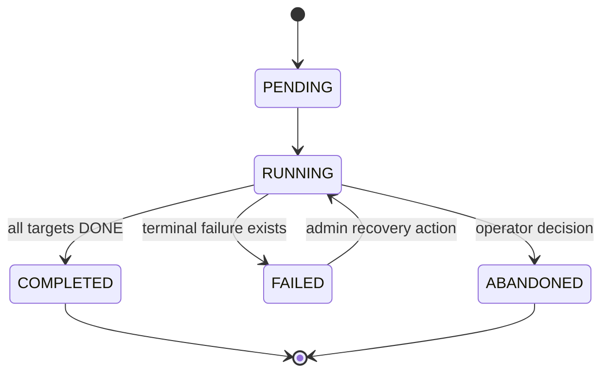
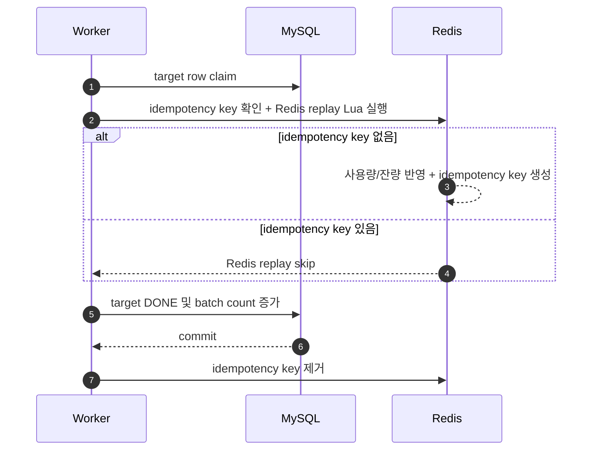

# Redis 장애 복구 배치 설계 명세

작성일: 2026-05-29  
상태: 설계 정리 완료, 구현 미승인  
원본 문서: `docs/plan/PLANS.md`  
대상 시스템: Redis 트래픽 잔량/사용량 복구 배치  
의존성 기준: Spring Boot 3.5.10, Spring Data Redis 3.5.8, Lettuce 6.6.0.RELEASE, Spring JDBC 6.2.15, MyBatis core 3.5.19 / starter 3.0.5, JUnit Jupiter 5.12.2, Mockito 5.17.0  
의존성 출처: `docs/context7-dependencies.yaml`  
Context7 사용 여부: `not_used` - 이 문서는 exact API signature 확인이 아니라 저장소 설계 명세 정리 작업입니다.

---

## 1. 승인 및 실행 경계

- 이 문서는 설계 명세이며 production code, schema, runtime 설정 변경을 승인하지 않습니다.
- 구현은 별도 구현 계획 `docs/superpowers/plans/2026-05-29-redis-restore-batch.md`가 사용자에게 명시적으로 승인된 뒤에만 시작합니다.
- 구현 전에는 `superpowers:using-git-worktrees`로 격리 workspace를 확인하거나 생성해야 합니다.
- 구현은 Redis Lua, Redis Streams, database schema, idempotency, batch processing, transaction boundary를 포함하므로 기본 실행 방식은 `superpowers:subagent-driven-development`입니다.
- subagent prompt에는 반드시 이 저장소의 `AGENTS.md`, dependency/Context7 규칙, 한국어 문서/리뷰 커뮤니케이션 규칙을 포함해야 합니다.
- codebase 변경 commit은 사용자 명시 확인 전 금지됩니다. 이는 superpowers의 frequent commit 권장보다 `AGENTS.md`의 commit rule이 우선 적용되는 지점입니다.

---

## 2. 목표

- Redis 장애로 휘발된 트래픽 잔량 key와 사용량 key를 DB 원천 데이터로 복구합니다.
- 금월 일별 사용량 동기화 배치 미완료 구간부터 장애 발생일까지의 `TRAFFIC_DEDUCT_DONE` 데이터를 Redis에 replay합니다.
- 장애 발생일이 매월 1일이고 미완료 시작일이 전월이면 전월 데이터까지 복구 범위에 포함할 수 있게 설계합니다.
- `LINE_DAILY_BATCH_JOB` 기반으로 phase별 metadata와 count를 관리합니다.
- Redis 반영 중복을 막기 위해 phase별 idempotency key를 사용합니다.
- 복구 중 traffic stream 신규 생산, poll, reclaim, worker 처리를 중단합니다.

## 3. 비목표

- dry-run API는 제공하지 않습니다.
- scheduler 자동 시작은 제공하지 않습니다.
- 복구 중 stream 메시지를 ACK, DLQ, done log 생성 처리하지 않습니다.
- 일반 정책 목록에 장애 복구 flag를 노출하지 않습니다.
- 복구 phase에 `FAILED` target이 남아 있는 상태에서 다음 phase로 전환하지 않습니다.

---

## 4. 용어

| 용어 | 의미 |
|---|---|
| 장애 발생일 | Redis 장애가 발생한 업무 기준일 |
| Anchor date | `LINE_DAILY_BATCH_JOB.usage_date`에 저장하는 복구 실행 기준일이며 장애 발생일을 사용 |
| 복구 대상 날짜 범위 | 일별 동기화 배치 미완료 시작일에서 장애 발생일까지 |
| 복구 대상 월 집합 | 복구 대상 날짜 범위에 포함된 모든 `YearMonth` |
| Phase 0 | 월별 잔량 snapshot과 전역 정책 Redis hydrate 단계 |
| Phase 1 | `DAILY_APP_TOTAL_DATA` 기반 Redis 사용량/잔량 replay 단계 |
| Phase 2 | 미완료 날짜 범위의 `TRAFFIC_DEDUCT_DONE` 기반 Redis replay와 검증/보정 단계 |
| Manager | target row insert와 phase 전환을 담당하는 단일 서버 역할 |
| Worker | target row 또는 done log를 병렬 처리하는 서버 역할 |

---

## 5. 전체 흐름

---

## 6. 핵심 결정사항

| 항목 | 결정 |
|---|---|
| 시작 방식 | 관리자 API 전용 시작 |
| dry-run | 미제공 |
| 복구 중 traffic 처리 | producer, poller, reclaim, worker 처리 진입 차단 |
| traffic 중단 대기 | 장애 복구 flag 활성화 후 `app.streams.reclaim-worst-processing-ms + 1000ms` 대기 |
| batch metadata | `LINE_DAILY_BATCH_JOB`에 phase별 row 저장 |
| target insert | 별도 batch로 취급 |
| target insert 주체 | manager 역할 서버 1대 |
| Redis 반영 주체 | 여러 worker 병렬 처리 |
| worker chunk 크기 | 기본 5000건, 환경변수 관리 |
| phase 전환 조건 | 모든 처리 대상이 `DONE` 상태일 때만 다음 phase 진입 |
| 다음 phase metadata insert | 별도 트랜잭션 처리 |
| target row table | phase 0, phase 1 용도별 분리 |
| phase 2 target row | 미사용, `TRAFFIC_DEDUCT_DONE.restore_*` 컬럼 사용 |
| 전체 검증 | phase 2 후처리로 수행 |
| 불일치 대응 | structured log 기록 후 자동 보정 |
| idempotency cleanup | 전체 복구 성공 후 `restore:idempotency:*` 제거 |

---

## 7. Traffic 중단 정책

### 7.1 장애 복구 flag

| 항목 | 값 |
|---|---|
| 저장소 | `POLICY` table |
| 성격 | 전역 정책 |
| Redis hydrate 대상 | 포함 |
| 일반 정책 목록 노출 | 제외 필요 |
| Redis key | `TrafficRedisKeyFactory.policyKey(policyId)` 규칙 사용 |
| 활성 의미 | 장애 복구 진행 중이며 traffic stream 생산/소비/처리를 중단 |

### 7.2 시작 절차

1. 관리자 복구 시작 API를 호출합니다.
2. DB `POLICY` 장애 복구 flag를 활성화합니다.
3. 전역 정책 hydrate를 실행합니다.
4. Redis 장애 복구 flag 활성 상태를 확인합니다.
5. `app.streams.reclaim-worst-processing-ms + 1000ms` 동안 대기합니다.
6. 복구 phase를 시작합니다.

### 7.3 차단 위치

| 위치 | flag active 시 동작 |
|---|---|
| 요청 enqueue 전 | Redis Stream `XADD` 금지, 요청 거부 |
| poll loop 전 | `XREAD` 진입 금지 |
| reclaim loop 전 | pending reclaim 진입 금지 |
| worker 처리 직전 | 처리 금지, ACK 금지, DLQ 금지 |

### 7.4 ACK 정책

- 장애 복구 flag active 상태에서 처리하지 않은 stream 메시지 ACK를 금지합니다.
- 처리하지 않은 메시지의 done log 생성을 금지합니다.
- 처리하지 않은 메시지의 DLQ 전송을 금지합니다.
- pending 상태를 유지하고 복구 종료 이후 reclaim 대상이 되도록 둡니다.

### 7.5 fail-closed 정책

- Redis 장애 복구 flag key 누락을 정상 처리로 간주하지 않습니다.
- Redis key 누락 시 전역 정책 hydrate를 1회 수행합니다.
- hydrate 후에도 flag 상태가 불명확하면 traffic 처리를 중단합니다.
- Redis 정책 상태 확인에 실패하면 traffic 처리를 중단합니다.

---

## 8. Batch metadata

### 8.1 저장 table

| table | 역할 |
|---|---|
| `LINE_DAILY_BATCH_JOB` | phase별 batch 실행 이력과 count 저장 |

### 8.2 `usage_date` 사용 규칙

| 컬럼 | 사용 방식 |
|---|---|
| `usage_date` | 복구 anchor date 저장 |
| anchor date | 장애 발생일 |
| 실제 처리 날짜 범위 | target table 또는 done log 조회 조건으로 별도 표현 |

### 8.3 batch_name

| 순서 | batch_name | 역할 |
|---:|---|---|
| 1 | `RESTORE_P0_TARGET_INSERT` | phase 0 hydrate target row 생성 |
| 2 | `RESTORE_P0_REDIS_HYDRATE` | line/family/global policy Redis hydrate |
| 3 | `RESTORE_P1_TARGET_INSERT` | phase 1 daily app target row 생성 |
| 4 | `RESTORE_P1_DAILY_APP_REPLAY` | `DAILY_APP_TOTAL_DATA` 기반 Redis replay |
| 5 | `RESTORE_P2_DONE_LOG_REPLAY` | done log replay와 검증/자동 보정 |

### 8.4 상태 전환 원칙

- `FAILED` target 존재 시 다음 phase 진입을 금지합니다.
- target row 전부 `DONE` 상태일 때만 phase를 완료합니다.
- 다음 phase metadata row 삽입은 이전 phase 완료 이후 별도 트랜잭션으로 처리합니다.
- target insert batch도 독립 batch로 count를 관리합니다.

---

## 9. Target row table

### 9.1 분리 원칙

- phase별 식별자 형태가 다르므로 target row table을 분리합니다.
- 문자열 target id 단일 컬럼 방식은 사용하지 않습니다.
- phase 0과 phase 1의 index, unique key, 검증 규칙을 분리합니다.

### 9.2 Phase 0 target table

후보 table: `RESTORE_HYDRATE_TARGET`

| 컬럼 | 의미 |
|---|---|
| `id` | auto increment PK |
| `batch_name` | 처리 batch 이름 |
| `target_month_start` | 대상 월의 1일 |
| `target_type` | `LINE`, `FAMILY`, `GLOBAL_POLICY` |
| `target_owner_id` | `line_id`, `family_id`, global policy는 `0` |
| `status` | target 처리 상태 |
| `status_updated_at` | 상태 변경 시각 |
| `worker_id` | `PROCESSING` 소유 worker |
| `retry_count` | 재시도 횟수 |
| `last_error_code` | 마지막 오류 코드 |
| `last_error_message` | 마지막 오류 메시지 |
| `created_at` | 생성 시각 |

권장 unique key:

| unique key | 목적 |
|---|---|
| `(batch_name, target_month_start, target_type, target_owner_id)` | phase 0 target 중복 생성 방지 |

### 9.3 Phase 1 target table

후보 table: `RESTORE_DAILY_APP_TARGET`

| 컬럼 | 의미 |
|---|---|
| `id` | auto increment PK |
| `batch_name` | 처리 batch 이름 |
| `usage_date` | `DAILY_APP_TOTAL_DATA.usage_date` |
| `line_id` | `DAILY_APP_TOTAL_DATA.line_id` |
| `application_id` | `DAILY_APP_TOTAL_DATA.application_id` |
| `status` | target 처리 상태 |
| `status_updated_at` | 상태 변경 시각 |
| `worker_id` | `PROCESSING` 소유 worker |
| `retry_count` | 재시도 횟수 |
| `last_error_code` | 마지막 오류 코드 |
| `last_error_message` | 마지막 오류 메시지 |
| `created_at` | 생성 시각 |

권장 unique key:

| unique key | 목적 |
|---|---|
| `(batch_name, usage_date, line_id, application_id)` | `DAILY_APP_TOTAL_DATA` target 중복 생성 방지 |

### 9.4 공통 target 상태

| 상태 | 의미 |
|---|---|
| `PENDING` | worker 미선점 |
| `PROCESSING` | worker 선점 중 |
| `DONE` | 정상 완료 |
| `RETRYABLE` | 재시도 가능 실패 |
| `FAILED` | 자동 복구 불가 또는 재시도 초과 |

---

## 10. 복구 대상 범위

### 10.1 날짜 범위

- 시작일: 금월 일별 동기화 배치 미완료 시작일
- 종료일: 장애 발생일
- 판단 기준: 장애 발생 시각이 아니라 일별 동기화 배치 완료 여부
- 금일 포함 가능

### 10.2 월 범위

- 복구 대상 날짜 범위에 포함된 모든 월을 포함합니다.
- 장애 발생일이 1일인 경우 전월 포함이 가능합니다.
- phase 0과 phase 1은 동일한 복구 대상 월 집합을 사용합니다.

| 장애 발생일 | 미완료 시작일 | 복구 대상 월 |
|---|---|---|
| 2026-05-20 | 2026-05-17 | 2026-05 |
| 2026-05-01 | 2026-04-30 | 2026-04, 2026-05 |

---

## 11. Phase 0: Redis hydrate

### 11.1 목적

- 복구 대상 월의 line 개인 잔량 snapshot을 hydrate합니다.
- 복구 대상 월의 family 공유 잔량 snapshot을 hydrate합니다.
- 전역 정책 상태를 hydrate합니다.
- 장애 복구 flag 전역 정책도 hydrate 대상에 포함합니다.

### 11.2 target insert 대상

| 대상 | 산출 기준 |
|---|---|
| `LINE` | `DAILY_APP_TOTAL_DATA` 월 데이터와 phase 2 done log 범위의 line union |
| `FAMILY` | line target의 `FAMILY_LINE` 매핑 family union |
| `GLOBAL_POLICY` | 전역 정책 상태와 장애 복구 flag |

### 11.3 hydrate 규칙

| target_type | Redis key | 처리 |
|---|---|---|
| `LINE` | `remaining_indiv_amount:{lineId}:{yyyyMM}` | DB snapshot 기준 hydrate/보정 |
| `FAMILY` | `remaining_shared_amount:{familyId}:{yyyyMM}` | DB snapshot 기준 hydrate/보정 |
| `GLOBAL_POLICY` | `policy:{policyId}` | `POLICY` 기준 hydrate |

### 11.4 family_id 미존재 처리

- `FAMILY_LINE`에서 family_id가 없는 line은 가족 결합 미소속 회선으로 처리합니다.
- phase 0 family target 생성을 생략합니다.
- 이는 정상 case입니다.

---

## 12. Phase 1: `DAILY_APP_TOTAL_DATA` replay

### 12.1 목적

- 복구 대상 월의 `DAILY_APP_TOTAL_DATA`를 기반으로 Redis 사용량을 복구합니다.
- Redis 잔량 key에 개인/공유 사용량을 반영합니다.
- QoS 사용량은 사용량 key에만 반영하고 잔량에서 차감하지 않습니다.

### 12.2 대상 범위 보완 규칙

- 기존 초안의 "복구 대상 월 전체 `DAILY_APP_TOTAL_DATA` replay"는 phase 2 done log replay와 중복될 위험이 있습니다.
- 구현 전 반드시 다음 둘 중 하나를 확정해야 합니다.
  - 미완료 날짜 범위의 `DAILY_APP_TOTAL_DATA` partial row를 정리한 뒤 phase 1에서 월 전체를 replay합니다.
  - phase 1은 일별 동기화 완료 구간의 `DAILY_APP_TOTAL_DATA`만 replay하고, 미완료 날짜 범위는 phase 2가 전담합니다.
- 이 결정이 없으면 구현을 시작하지 않습니다.

### 12.3 Redis idempotency key

| 항목 | 값 |
|---|---|
| key pattern | `restore:idempotency:p1:daily_app:{yyyyMMdd}:{lineId}:{applicationId}` |
| TTL | 없음 |
| 생성 시점 | Redis replay와 같은 Lua 원자 구간 |
| 제거 시점 | MySQL target 상태 갱신 commit 이후 |
| 잔여 cleanup | 전체 복구 성공 후 prefix scan 삭제 |

### 12.4 처리 순서

### 12.5 Redis 반영 규칙

| 데이터 | 잔량 반영 | 사용량 반영 |
|---|---|---|
| `individual_usage_data` | `remaining_indiv_amount.amount` 차감 | `daily_total_usage`, `daily_app_usage app:{appId}:individual` 증가 |
| `shared_usage_data` | `remaining_shared_amount.amount` 차감 | `daily_total_usage`, `daily_app_usage app:{appId}:shared`, `daily_shared_usage`, `monthly_shared_usage` 증가 |
| `qos_usage_data` | 차감 없음 | `daily_total_usage`, `daily_app_usage app:{appId}:qos` 증가 |

### 12.6 무제한 잔량 규칙

- `amount = -1`은 무제한 잔량 의미입니다.
- `amount = -1`이면 잔량 차감을 금지합니다.
- `amount < -1`은 시스템 오류입니다.
- 무제한이 아닌 잔량이 음수로 내려가면 시스템 오류입니다.

### 12.7 family_id 처리

- `line_id` 기준 `FAMILY_LINE`을 조회합니다.
- family_id 미존재 시 가족 결합 미소속 회선으로 정상 처리합니다.
- shared 사용량이 `0`이면 family 관련 Redis 반영을 생략합니다.
- shared 사용량이 양수이고 family_id가 없으면 데이터 불일치 가능성으로 target을 `FAILED` 처리합니다.

---

## 13. Phase 2: Done log replay

### 13.1 목적

- 일별 동기화 배치 미완료 날짜 범위의 done log 기반으로 Redis를 복구합니다.
- phase 1과 동일한 Redis 사용량/잔량 반영 규칙을 적용합니다.
- phase 2 target row는 만들지 않고 `TRAFFIC_DEDUCT_DONE.restore_*` 컬럼으로 처리 상태를 관리합니다.

### 13.2 대상

- 복구 대상 날짜 범위의 `TRAFFIC_DEDUCT_DONE`
- 날짜 판단 기준: `enqueued_at`의 Asia/Seoul 업무일
- 사용 컬럼:
  - `traffic_deduct_done_id`
  - `line_id`
  - `family_id`
  - `app_id`
  - `deducted_individual_bytes`
  - `deducted_shared_bytes`
  - `deducted_qos_bytes`
  - `restore_status`
  - `restore_status_updated_at`
  - `restore_retry_count`
  - `restore_last_error_message`

### 13.3 restore 상태

| 상태 | 의미 |
|---|---|
| `NONE` | 복구 미처리 |
| `PROCESSING` | worker 처리 중 |
| `DONE` | 복구 완료 |
| `RETRYABLE` | 재시도 가능 실패 |
| `FAILED` | 자동 복구 불가 또는 재시도 초과 |

### 13.4 Redis idempotency key

| 항목 | 값 |
|---|---|
| key pattern | `restore:idempotency:p2:done_log:{trafficDeductDoneId}` |
| TTL | 없음 |
| 생성 시점 | Redis replay와 같은 Lua 원자 구간 |
| 제거 시점 | MySQL `restore_status = DONE` commit 이후 |
| 잔여 cleanup | 전체 복구 성공 후 prefix scan 삭제 |

---

## 14. 전체 검증 및 자동 보정

### 14.1 검증 대상

| Redis key | 검증 기준 |
|---|---|
| `remaining_indiv_amount:{lineId}:{yyyyMM}` | hydrate 기준 개인 잔량 - 개인 사용량 replay 합계 |
| `remaining_shared_amount:{familyId}:{yyyyMM}` | hydrate 기준 공유 잔량 - 공유 사용량 replay 합계 |
| `daily_total_usage:{lineId}:{yyyyMMdd}` | 개인 + 공유 + QoS 사용량 합계 |
| `daily_app_usage:{lineId}:{yyyyMMdd}` | app별 individual/shared/qos 사용량 합계 |
| `daily_shared_usage:{lineId}:{yyyyMMdd}` | line별 공유 사용량 합계 |
| `monthly_shared_usage:{lineId}:{yyyyMM}` | line별 월 공유 사용량 합계 |
| `policy:{policyId}` | DB `POLICY` 기준 전역 정책 상태 |

### 14.2 보정 원칙

- 전체 검증은 필수입니다.
- sampling 검증은 금지합니다.
- 불일치 발견 시 structured log를 기록합니다.
- Redis 값을 검증 기준값으로 자동 보정합니다.
- 보정 실패 시 phase 2 batch를 `FAILED` 처리합니다.
- 보정 성공 후 idempotency key cleanup을 진행합니다.

---

## 15. Redis Lua 원자성 요구사항

### 15.1 Phase 1 Lua

- 입력:
  - phase 1 idempotency key
  - 잔량 key
  - 사용량 key
  - `usage_date`
  - `line_id`
  - `application_id`
  - individual/shared/qos 사용량
  - optional family_id
  - expire epoch seconds
- 원자 동작:
  - idempotency key 존재 확인
  - idempotency key 존재 시 Redis replay skip 반환
  - idempotency key 미존재 시 사용량/잔량 반영
  - idempotency key 생성
  - 결과 반환

### 15.2 Phase 2 Lua

- 입력:
  - phase 2 idempotency key
  - 잔량 key
  - 사용량 key
  - done log 식별자
  - line/family/app 식별자
  - individual/shared/qos 차감량
  - expire epoch seconds
- 원자 동작:
  - phase 1 Lua와 동일한 idempotency/replay 계약

### 15.3 idempotency key 잔류 처리

| 상황 | 처리 |
|---|---|
| Redis replay 후 MySQL commit 전 worker 사망 | 다음 worker가 idempotency key 확인 후 Redis skip, MySQL DONE 처리 |
| MySQL commit 후 idempotency key delete 전 worker 사망 | 전체 복구 성공 후 prefix cleanup |
| 복구 실패/중단 | idempotency key 보존 |
| 복구 최종 성공 | `restore:idempotency:*` cleanup |

---

## 16. 운영 API

| API | 역할 |
|---|---|
| Restore Start API | 장애 복구 flag 활성화, 대기, phase 0 시작 |
| Restore Resume API | 중단 상태 복구 batch worker 재개 |

- 관리자 권한이 필수입니다.
- dry-run은 제공하지 않습니다.
- scheduler 자동 시작은 제공하지 않습니다.
- 복구 시작은 관리자 명시 요청 기반입니다.
- phase scope 확장 발생 시 중단 후 재분해합니다.

---

## 17. 기존 일별 배치 재사용 경계

### 17.1 벤치마크할 요소

| 요소 | 적용 |
|---|---|
| manager lock | 적용 |
| target row `FOR UPDATE SKIP LOCKED` claim | 적용 |
| `PROCESSING` lease timeout | 적용 |
| retry count | 적용 |
| `FAILED` target 재처리 정책 | 적용 |
| batch metadata count | 적용 |

### 17.2 그대로 재사용하지 않을 요소

| 요소 | 사유 |
|---|---|
| `usage_date` 단일 target set | 복구 batch는 월/phase 범위 기반 |
| 기존 `LINE_DAILY_BATCH_TARGET` | phase 1 복합 PK 표현 불가 |
| failed 포함 완료 조건 | 복구 phase는 모두 `DONE` 필요 |
| DB insert 중심 트랜잭션 | Redis replay idempotency Lua 필요 |

---

## 18. 구현 전 확정 필요 항목

| 항목 | 확정 기준 |
|---|---|
| 장애 복구 flag `policy_id` | 고정 ID 또는 별도 식별 전략. 후보 `8`은 운영 데이터 충돌 확인 필요 |
| 일반 정책 목록 제외 방식 | `policy_name` 규칙 또는 별도 category 기반 제외 방식 중 하나 확정 |
| phase 1 대상 범위 | 월 전체 replay 전 partial row 정리 방식 또는 완료 구간만 replay 방식 중 하나 확정 |
| worker chunk env 이름 | `TRAFFIC_RESTORE_WORKER_CHUNK_SIZE` 등 실제 환경변수명 확정 |
| manager lock key 이름 | 기존 daily batch lock과 분리된 restore 전용 key 이름 확정 |
| phase 2 조회 index | `restore_status`, `enqueued_at`, `status_updated_at` 기반 index 형태 확정 |
| 보정 Lua 분리 여부 | replay Lua와 verification correction Lua를 분리할지 확정 |

---

## 19. 구현 전 금지사항

- 사용자 승인 없는 code 구현 금지
- 사용자 승인 없는 schema 변경 금지
- dry-run API 추가 금지
- 복구 중 stream 메시지 ACK 금지
- `FAILED` target 존재 상태에서 다음 phase 진입 금지
- QoS 사용량의 잔량 차감 금지
- 무제한 잔량 `-1` 차감 금지
- 일반 정책 목록에 장애 복구 flag 노출 금지
