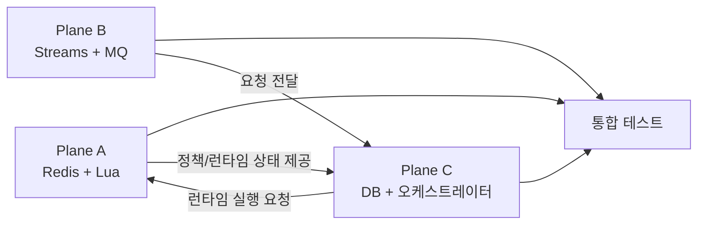

# 트래픽 제너레이터 3인 병렬 고도화 통합 가이드 v1

## 0. 문서 메타데이터

| 항목 | 값 |
| --- | -- |
| 문서 버전 | v1 |
| 문서 상태 | `Contract v1 Locked` |
| 기준 타임존 | `Asia/Seoul` |
| 작성일 | `2026-03-12` |
| 목표 완료일 | `2026-03-15` |
| 문서 성격 | 개발/테스트/운영 통합 가이드 |

## 1. 문서 목적 및 프로젝트 현황 (요약)

이 문서는 트래픽 제너레이터 고도화 작업을 3개 Plane(A/B/C)으로 분리해 병렬 개발 충돌을 줄이고, Contract Lock으로 경계와 책임을 통제해 정합성 붕괴 리스크를 최소화하기 위한 통합 지침서다.

목표:
- Plane 경계 고정
- Contract v1 잠금 유지
- Big Step 일정 기반 병렬 고도화
- E2E + HA 장애 복구 검증 완료

현재 구현 상태(요약):
- Lua 스크립트 5종 완료: `deduct_indiv_tick`, `deduct_shared_tick`, `refill_gate`, `lock_heartbeat`, `lock_release`
- Redis 3분리 설정 완료: Session / Cache / Streams
- 모듈 골격 완료:
  - Traffic 모듈 약 40개 클래스
  - Metrics 모듈 7개 클래스
  - Policy 모듈(Admin/User) 완성

## 2. 공통 협업 원칙 (Lock Rules)

- 계약 잠금 전에는 Plane 내부 구현만 진행한다.
- 계약 잠금 후에만 Plane 경계 로직을 구현한다.
- Contract v1은 추가만 허용한다.
- Contract v1의 필드 삭제/의미 변경은 금지한다.
- 브레이킹 변경은 반드시 Contract v2로 분리한다.
- 변경 배포는 주 1회 배치를 원칙으로 한다. 긴급 hotfix만 예외다.

## 3. Big Step 일정

| 단계 | 일정(절대 날짜) | 목표 |
| --- | --- | --- |
| 사전 단계 | `2026-03-12` (30분) | 기존 DTO/Enum/Interface와 계약 일치 여부 확인 후 잠금 |
| Step 1 | `~2026-03-13` | 테스트 보강 + 실패 로깅 정리 |
| Step 2 | `~2026-03-14` | 성능 고도화 + 안정성 보강 |
| Step 3 | `~2026-03-15` | AWS `n100000` E2E + HA 복구 검증 |

Step별 핵심:
- Step 1:
  - A: Lua 반환 계약, 키/TTL, lock/dedupe 테스트
  - B: Streams 소비/ACK/DLQ, payload 검증 테스트
  - C: tick 분배/풀전환/DB 원자성/ledger 전이 테스트
  - 공통: 실패 로그 구현, 불필요한 성공 로그 제거
- Step 2:
  - A: `EVALSHA` TPS 최적화, Redis 장애 시 락/중복 반영 방지
  - B: 소비기 스케일아웃, 커넥션풀/리클레임 안정화
  - C: deadlock 재시도 최적화, refill ledger 재처리 워커
  - 공통: 로컬 TPS `n100 -> n10000` 정합성 재검증
- Step 3:
  - 공통: AWS `n100000` E2E, 장애 주입 기반 HA 복구 검증

## 4. Plane 소유권 매트릭스

| Plane | 역할명 | 소유 책임 | 비소유 책임 |
| --- | --- | --- | --- |
| A | Runtime State Owner | Redis/Lua 실행 계약, 키/TTL 규칙, lock/dedupe, speed bucket, policy write-through | 최종 비즈니스 판정, DB 트랜잭션/ledger 전이 |
| B | Intake & Delivery Owner | API 수신, traceId 부여, Streams 적재/소비, ACK/DLQ/reclaim, DONE 저장 트리거 | tick 분배, refill 계산, Redis 정책 규칙 결정 |
| C | Decision & Consistency Owner | 10-tick 오케스트레이션, DB refill 원자 처리, ledger 상태 전이/재처리, 최종 판정 | Streams 그룹 운영, Lua 내부 구현 디테일 |

소유권 고정:
- ACK/DONE 순서 보장: Plane B
- 최종 상태 판정: Plane C
- Redis 키/정책 규칙: Plane A

## 5. Contract v1 (Locked)

이 섹션이 계약의 단일 진실원(Single Source of Truth)이다.

```yaml
contract_version: v1
breaking_rule:
  allow: ["field_addition"]
  deny: ["field_removal", "semantic_change"]
  breaking_change: "must_create_v2"

b_to_c_request:
  owner_in: "Plane B"
  owner_out: "Plane C"
  source_refs:
    - "TrafficPayloadReqDto.java"
  required_fields:
    traceId: "string(uuid)"
    lineId: "long"
    familyId: "long"
    appId: "int"
    apiTotalData: "long(bytes)"
    enqueuedAt: "epoch_millis"
    retryCount: "int"
    streamMessageId: "string"
  validation_rule: "missing_or_type_mismatch -> DLQ"

c_to_a_runtime:
  owner_in: "Plane C"
  owner_out: "Plane A"
  source_refs:
    - "TrafficLuaStatus.java"
    - "Lua JSON schema"
  request_required:
    commandId: "string"
    traceId: "string(uuid)"
    tickNo: "int(1..10)"
    operation: "enum(deduct, refill, gate, heartbeat, release)"
    poolType: "enum(indiv, shared)"
    amount: "long(bytes)"
    policyVersion: "string"
    nowEpochSec: "epoch_seconds"
  response_required:
    answer: "enum(OK, NO_BALANCE, WAIT, SKIP, FAIL)"
    status: "enum(SUCCESS, RETRYABLE, NON_RETRYABLE)"
    reasonCode: "enum(shared_reason_code_dictionary)"
    appliedAmount: "long(bytes)"
    remainingAmount: "long(bytes)"
  note: "Lua raw numeric answer는 appliedAmount로 정규화한다."

c_to_b_result:
  owner_in: "Plane C"
  owner_out: "Plane B"
  source_refs:
    - "TrafficDeductDone.java"
    - "TrafficFinalStatus.java"
  required_fields:
    traceId: "string(uuid)"
    finalStatus: "enum(SUCCESS, PARTIAL_SUCCESS, FAILED)"
    processedAmount: "long(bytes)"
    failureReason: "string"
    idempotencyKey: "string(traceId)"
  ack_rule: "persist_success_then_ack_only"
```

정합성 주의:
- `finalStatus`는 `SUCCESS | PARTIAL_SUCCESS | FAILED`만 허용한다.
- `PARTIAL` 단독 표기는 금지한다.

## 6. 의존 관계 및 통합 순서



Mermaid 미지원 뷰어용:

```text
[Plane B] --(요청 전달)--> [Plane C]
[Plane C] --(런타임 실행 요청)--> [Plane A]
[Plane A] --(정책/런타임 상태 제공)--> [Plane C]

[Plane A] --> [통합 테스트]
[Plane B] --> [통합 테스트]
[Plane C] --> [통합 테스트]
```

선행 합의 항목:
- `B -> C` 요청 DTO 필드 고정
- `C <-> A` 호출 시그니처 + 반환 스키마 고정
- Redis key namespace prefix 고정

## 7. 담당자별 상세 구현 책임

### 7.1 Plane A (Runtime State Owner)

주요 작업:
- 3.6 Lua 자산화: SHA preload, `EVALSHA`, JSON 파싱
- 3.7 Redis 규칙: namespace, 일/월 `EXPIREAT`, speed bucket TTL
- 3.8 Redis 측 계산/버킷 규칙: delta, 10초 평균/fallback
- 3.10 동시성/중복: `dedupe:run:{traceId}`, lock heartbeat/release
- 3.13 정책 write-through

주요 파일:
- `src/main/java/com/pooli/traffic/service/TrafficLuaScriptInfraService.java`
- `src/main/java/com/pooli/traffic/service/TrafficRedisKeyFactory.java`
- `src/main/java/com/pooli/traffic/service/TrafficRedisRuntimePolicy.java`
- `src/main/java/com/pooli/traffic/service/TrafficRecentUsageBucketService.java`
- `src/main/java/com/pooli/traffic/service/TrafficInFlightDedupeService.java`
- `src/main/java/com/pooli/traffic/service/TrafficQuotaCacheService.java`
- `src/main/java/com/pooli/traffic/service/TrafficPolicyWriteThroughService.java`
- `src/main/resources/lua/traffic/*.lua`

도메인/메트릭:
- 도메인: `TrafficLuaExecutionResult`, `TrafficRefillPlan`, `TrafficLuaDeductResDto`, `TrafficLuaScriptType`, `TrafficLuaStatus`, `TrafficRefillGateStatus`
- 메트릭: `TrafficTickMetrics`, `TrafficRefillMetrics`, `TrafficHydrateMetrics`

HA 책임:
- Lua 비정상 응답 방어
- TTL 오작동 방지
- 동일 traceId 단일 유효 처리
- Redis 노드 다운 + lock TTL 만료 지연 장애 복구

### 7.2 Plane B (Intake & Delivery Owner)

주요 작업:
- 3.2 설정 분리: `local/api/traffic`, `.env` 키 매핑
- 3.3/3.4 DTO 검증, API 엔드포인트(`XADD`), traceId 생성
- 3.5/3.11 `XREADGROUP BLOCK`, DONE 영속 후 ACK 보장
- 3.12 `XPENDING/XCLAIM`, max retry 초과 DLQ

주요 파일:
- `src/main/java/com/pooli/traffic/service/TrafficStreamConsumerRunner.java`
- `src/main/java/com/pooli/traffic/service/TrafficStreamInfraService.java`
- `src/main/java/com/pooli/traffic/service/TrafficStreamReclaimService.java`
- `src/main/java/com/pooli/traffic/service/TrafficRequestEnqueueService.java`
- `src/main/java/com/pooli/traffic/service/TrafficPayloadValidationService.java`
- `src/main/java/com/pooli/traffic/service/TrafficDeductDonePersistenceService.java`
- `src/main/java/com/pooli/traffic/controller/TrafficController.java`
- `src/main/java/com/pooli/traffic/mapper/TrafficDeductDoneMapper.java`
- `src/main/java/com/pooli/traffic/config/TrafficSchedulingConfig.java`
- `src/main/java/com/pooli/common/config/StreamsRedisConfig.java`

도메인/메트릭:
- 도메인: `TrafficStreamFields`, `TrafficPayloadReqDto`, `TrafficGenerateReqDto`, `TrafficGenerateResDto`, `TrafficDeductDone`
- 메트릭: `TrafficRequestMetrics`, `TrafficDlqMetrics`, `RedisStreamMetrics`, `TrafficGeneratorMetrics`

HA 책임:
- 빈/깨진 payload 방어
- DONE 실패 시 ACK 금지
- 재수신 idempotent 처리
- Consumer 다운/스케일아웃 경쟁 장애 복구

### 7.3 Plane C (Decision & Consistency Owner)

주요 작업:
- 3.9 10-tick 오케스트레이터 (분배/전환/조기 종료)
- 3.8 `SELECT ... FOR UPDATE` 기반 actual refill 정합성
- 3.15 ledger 상태 전이 `INIT -> DB_DEDUCTED -> REDIS_APPLIED`
- 3.14/3.16 deadlock 재시도, 월 경계, soft-delete, 음수 잔량 방어

주요 파일:
- `src/main/java/com/pooli/traffic/service/TrafficDeductOrchestratorService.java`
- `src/main/java/com/pooli/traffic/service/TrafficHydrateRefillAdapterService.java`
- `src/main/java/com/pooli/traffic/service/TrafficDefaultQuotaSourceAdapter.java`
- `src/main/java/com/pooli/traffic/service/TrafficQuotaSourcePort.java`
- `src/main/java/com/pooli/traffic/mapper/TrafficRefillSourceMapper.java`
- `src/main/java/com/pooli/traffic/service/TrafficSystemTickPacer.java`
- `src/main/java/com/pooli/traffic/service/TrafficLinePolicyHydrationService.java`
- `src/main/java/com/pooli/traffic/service/TrafficPolicyBootstrapService.java`
- `(신규) refill ledger DDL/Mapper`

도메인:
- `TrafficDbRefillClaimResult`, `TrafficDeductResultResDto`, `TrafficFinalStatus`, `TrafficPoolType`

HA 책임:
- `SUCCESS/PARTIAL_SUCCESS/FAILED` 판정 일관성
- ledger 전이 누락/중복 방지
- DB deadlock, Redis 충전 실패, 월 경계/음수 잔량 장애 복구

## 8. 테스트 게이트 (필수)

Plane A:
- Lua 반환 계약 파싱 + 비정상 응답 방어
- 키/TTL 규칙 검증
- 락 게이트(`OK/WAIT/SKIP/FAIL`)와 heartbeat/release 소유권 검증
- 동일 traceId 중복 실행 방지

Plane B:
- API -> payload 직렬화/역직렬화 + 필수 필드 검증
- DONE 성공 후 ACK, 실패 시 ACK 금지
- reclaim + DLQ 흐름 검증
- consumer 재기동 후 pending 복구

Plane C:
- `ceil(apiRemaining/remainingTicks)` 분배 규칙 검증
- 개인풀 -> 공유풀 전환 규칙 검증
- DB 원자성 + ledger 전이 검증
- deadlock 재시도 상한/월 경계/음수 잔량 방어 검증

통합 게이트:
- Contract 호환성(`B->C`, `C<->A`, `C->B`)
- E2E(요청 -> 소비 -> 오케스트레이션 -> Redis/DB -> DONE/ACK)
- 장애 복구(Redis 다운, DB deadlock, consumer 중단)

## 9. 에러 코드 및 로깅 정책

에러 코드 소유권:
- `PAYLOAD_INVALID`: Plane B
- `REDIS_TIMEOUT`: Plane A
- `DEADLOCK_RETRY_EXCEEDED`: Plane C
- `LEDGER_REPLAY_FAILED`: Plane C
- `ACK_BLOCKED_BY_PERSIST_FAIL`: Plane B

로깅 규칙:
- 실패 로그 공통 포맷 정의는 Plane C가 소유한다.
- 실패 로그 구현은 A/B/C가 각자 소유 Plane에서 수행한다.
- 성공 로그는 Plane B가 local-only 수준으로 최소화한다.

권장 실패 로그 필드:
- `traceId`
- `timestamp`
- `lineId`
- `familyId`
- `appId`
- `plane`
- `reasonCode`
- `operation`
- `retryCount`

## 10. 운영 규칙

- API 실패 응답코드는 현재 `TBD`다.
- 임시 정책은 Plane B가 구현한다.
- 확정 후 일괄 치환한다.
- 로컬 Redis 테스트는 `pooli 정리/docker/` 구성 사용을 권장한다.

## 11. Codex/LLM 친화 작업 템플릿

작업 요청 템플릿:

```text
[Plane] A | B | C
[Goal] 구현 단계 번호 + 완료 조건
[Files] 변경 대상 파일 목록
[Contract Impact] 없음 | v1 필드 추가 | 브레이킹(v2 필요)
[Tests] 단위/통합/프로파일 중 수행 범위
[Out of Scope] 이번 작업에서 제외할 항목
```

LLM 응답 규칙:
- 계약 필드명은 원문 그대로 사용한다.
- Enum 문자열은 대소문자를 고정한다.
- 모호한 축약어를 사용하지 않는다.
- `PARTIAL` 대신 `PARTIAL_SUCCESS`를 사용한다.
- 날짜는 `YYYY-MM-DD`로 고정한다.

PR 체크리스트:
- [ ] Contract v1 필수 필드/타입 임의 변경 없음
- [ ] 소유 Plane 외 로직 침범 없음
- [ ] 역할별 테스트 게이트 통과
- [ ] `docs/junit-unit-test-guide.md` 기준 단위 테스트 품질 점검
- [ ] 통합 게이트 영향도 코멘트 포함

## 12. 부록: 책임 경계 빠른 조회

| 항목 | 최종 책임 Plane |
| --- | --- |
| ACK/DONE 순서 | B |
| 최종 상태 판정 | C |
| Redis 키/TTL 규칙 | A |
| payload 검증 실패 처리 | B |
| DB deadlock 재시도 정책 | C |
| Redis lock heartbeat/release | A |

