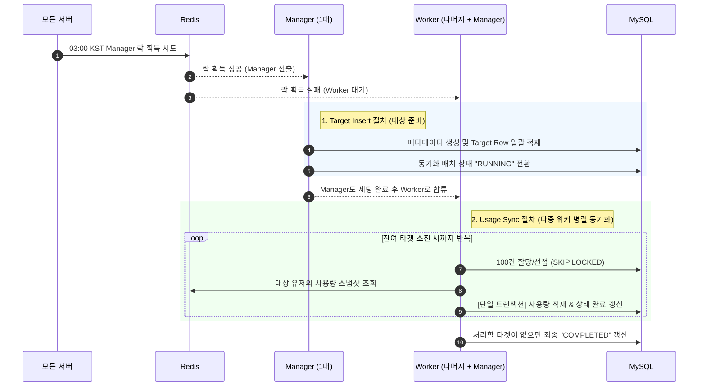
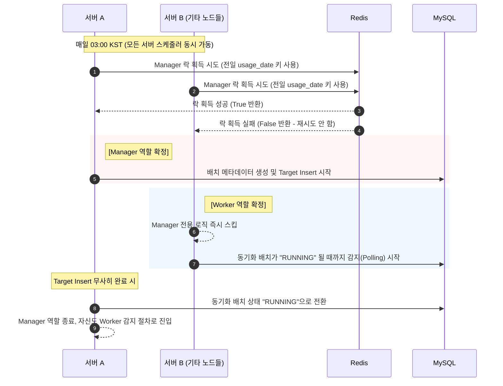
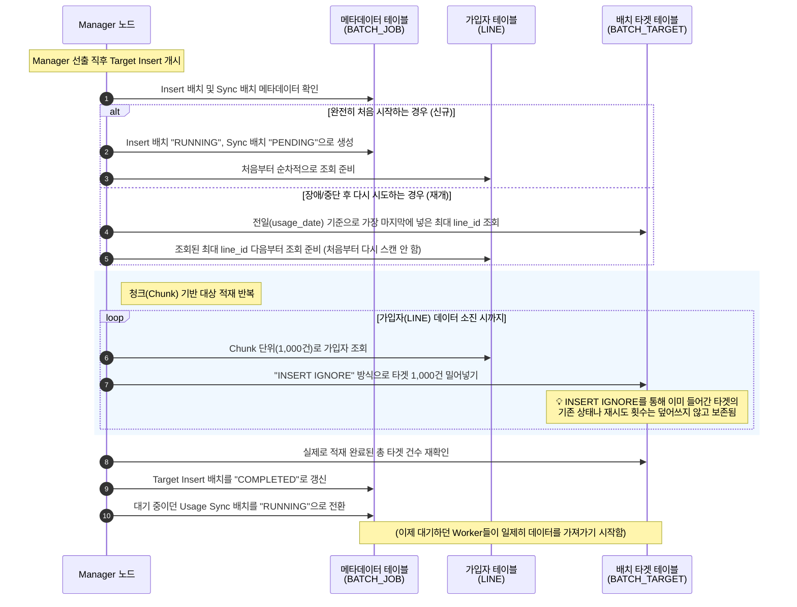
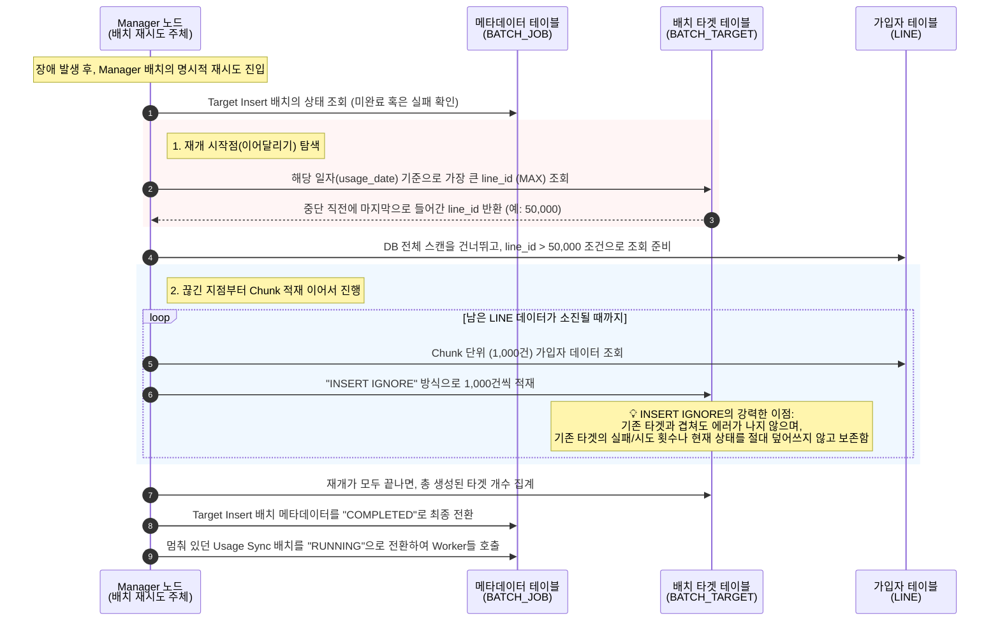
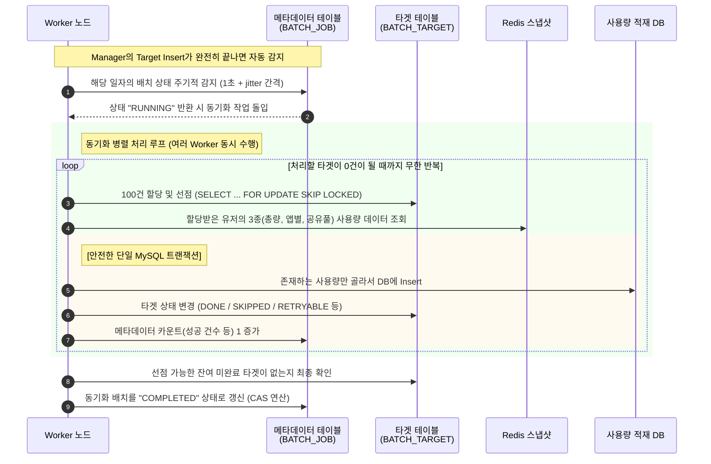
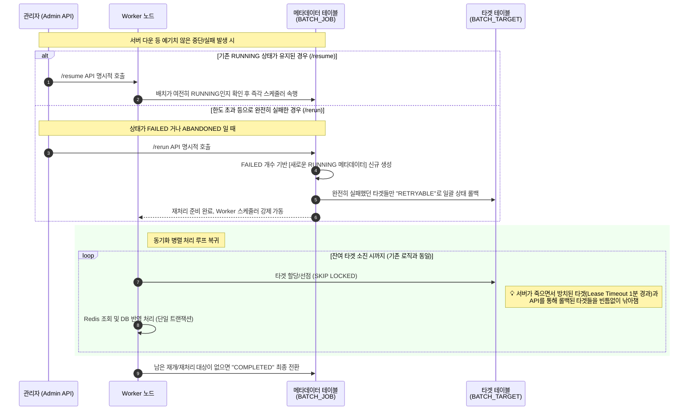

# 일별 동기화 배치 시스템 정리 문서

본 문서는 일별 트래픽 배치 시스템의 구성 및 동작 절차를 명사 종결형 개조식으로 요약한 가이드입니다.

## 1. 동기화 배치 절차 구성 요소
* **Scheduler**: 매일 03:00 KST 전 노드 배치 트리거
* **Manager 노드**: Redis 분산 락 획득 기반 단일 리더 선출, 메타데이터 생성 및 Target Insert 배치 수행
* **Worker 노드**: Manager 외 서버 및 작업 완료 Manager 서버, Redis-DB 동기화 처리를 위한 Claim 루프 병렬 실행
* **Redis**: Manager 선출용 분산 락 및 일별 트래픽 사용량 원본 데이터 저장소
* **MySQL**: 메타데이터(`LINE_DAILY_BATCH_JOB`), 배치 대상(`LINE_DAILY_BATCH_TARGET`), 최종 사용량 데이터 영속화 저장소

## 2. Manager 노드 선별 과정
* **시점**: 매일 03:00 KST
* **대상**: `traffic`, `local` 프로파일 구동 전 서버
* **방식**: 동일 전일 `usage_date` 기준 Redis Manager Lock 1회 획득 시도 (재시도 없음)
* **분기**:
    * **성공 (1대)**: Manager 선출, 메타데이터 생성 및 Target Insert 배치 수행, 완료 후 Worker 시작 감지 돌입
    * **실패 (나머지)**: Manager 작업 스킵, 즉시 해당 `usage_date` Worker 시작 감지(Polling) 돌입

## 3. Target Insert Batch 절차
### 신규 시작 절차
* **메타데이터 생성**: Manager 노드가 `LINE_DAILY_TARGET_INSERT_BATCH` (RUNNING) 및 `LINE_DAILY_USAGE_SYNC_BATCH` (PENDING) 생성
* **타겟 적재**: 전일 `usage_date` 기준 `LINE` 테이블 순회, 청크(1,000건) 단위 `INSERT IGNORE`로 `LINE_DAILY_BATCH_TARGET` 적재
* **상태 전환**: Target Insert 완료 후 Job 카운트 갱신 및 `COMPLETED` 전환, 이후 Usage Sync Batch `RUNNING` 전환

### 중단 시 재개 절차
* **복구 주체**: Worker 개입 없이 Manager 배치의 명시적 재시도를 통해서만 복구 수행
* **재개 지점**: `LINE_DAILY_BATCH_TARGET`의 해당 `usage_date` 기준 최대 `line_id` 조회 후 이후 시점부터 청크 이어붙이기 (Chunk Insert)
* **데이터 보존**: `INSERT IGNORE` 유지로 기존 타겟의 처리 상태 및 재시도 횟수 보존

## 4. 동기화 배치 절차 (Usage Sync Batch)
### 신규 시작 절차
* **시작 대기**: Worker 노드들은 해당 `usage_date` Job이 `RUNNING` 상태가 될 때까지 `1초 + jitter` 간격 대기
* **타겟 선점**: `RUNNING` 전환 시 MySQL `SELECT ... FOR UPDATE SKIP LOCKED` 구문으로 PENDING, RETRYABLE, Lease Timeout(1분) 초과 PROCESSING 대상 청크 단위(100건) 선점 후 즉시 락 해제
* **데이터 조회**: 선점 타겟 기준 Redis 3종 Key 조회
* **동기화 처리**: 단일 MySQL 트랜잭션 내에서 사용량 테이블 Insert, 대상 Row Terminal(DONE/SKIPPED 등) 전환, Job 메타데이터 성공 카운트 증가 동시 수행
* **완료 처리**: 잔여 선점 타겟 소진 시 미완료 Row 재확인, 전건 처리 완료 시 Job `COMPLETED` 상태 CAS 갱신

### 중단 시 재개 절차
* **재개 방식**: 서버 기동 시 자동 감지 불가, 명시적 관리자 API 호출 기반 제어
* **기존 RUNNING 상태 재개**:
    * API: `POST /api/admin/traffic/batches/daily-usage-sync/{usageDate}/resume`
    * 동작: 잔여 PENDING/PROCESSING/RETRYABLE 타겟 대상 Worker 스케줄러 재가동
* **FAILED/ABANDONED 상태 재처리 (Rerun)**:
    * API: `POST /api/admin/traffic/batches/daily-usage-sync/{usageDate}/rerun`
    * 동작: 기존 FAILED 타겟 수 기반 신규 `LINE_DAILY_USAGE_SYNC_BATCH` (RUNNING) 메타데이터 생성
    * 동작: 기존 FAILED 타겟 `RETRYABLE` 롤백 후 재처리 (DONE/SKIPPED 안전 무시)

## 5. 활용 Redis Key 목록
* **일별 총 사용량**: `pooli:daily_total_usage:{lineId}:{yyyymmdd}`
* **일별 앱 사용량**: `pooli:daily_app_usage:{lineId}:{yyyymmdd}` (Hash - 필드: `app:{appId}:individual`, `app:{appId}:shared`, `app:{appId}:qos`)
* **일별 공유풀 사용량**: `pooli:daily_shared_usage:{lineId}:{yyyymmdd}` (Hash - 필드: `usage_amount`, `family_id`)

## 6. 배치 제약조건
* **기술 스택**: Spring Batch, Redis Pub/Sub, Redis Streams 사용 불가
* **정합성 기준**: 순수 MySQL Lock 매커니즘(`SKIP LOCKED`)
* **적재 원칙**: 데이터베이스 Insert-only 기반, 중복 키 삽입 시도는 갱신이 아닌 실패 시그널로 간주
* **타임아웃**: Worker 선점 후 1분 경과 시 Lease Timeout 처리 (타 Worker 강제 재할당 대상)
* **실행 순서**: Target Insert 완전 종료 후 Usage Sync Worker 진입 강제
* **메타데이터 식별**: `LINE_DAILY_BATCH_TARGET` 내 `batch_job_id` 미포함, `usage_date` 기반 집합 식별

## 7. 배치 기능 요구사항
* **스냅샷 적재**: Redis 3종 Key 조회 후 3개 목적 DB(`DAILY_TOTAL_DATA`, `DAILY_APP_TOTAL_DATA`, `FAMILY_SHARED_USAGE_DAILY`)로 분할 저장
* **부분 상태(Partial) 처리**: 일부 Key만 존재 시 해당 데이터만 Insert 후 `DONE`, 전체 누락 시 Insert 생략 후 `SKIPPED` 처리
* **재시도**: 인프라 등 일시적 장애 시 최대 10회 `RETRYABLE` 처리, 한도 초과 및 복구 불가 오류는 `FAILED` 마킹

## 8. 배치 비기능 요구사항
* **멱등성 및 원자성**:
    * Target Insert: `INSERT IGNORE` 기반 중복 생성 방어
    * DB 동기화: DB Insert, 타겟 상태 갱신, Job 카운트 증가를 묶은 단일 MySQL 트랜잭션 사용으로 부분 실패 원천 차단
* **스레드 경합 방지**: TaskScheduler `pool.size` 2 확장으로 Manager Cron(03:00)과 Worker Polling 주기 간 병목 해소
* **모니터링**: Micrometer 메트릭(`batch_daily_usage_sync_failed_count` 등) 연동을 통한 Prometheus 수집 지원
* **알람 연동**: 데드라인(06:00) 초과 또는 `failed_count > 0` 발생 시 Discord 알림 발송 환경 구성
